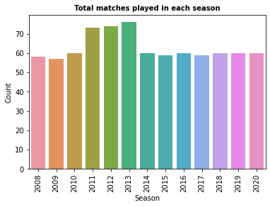
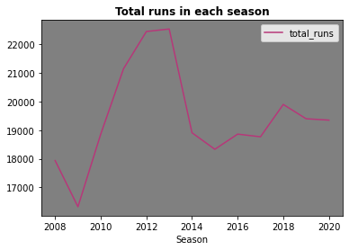
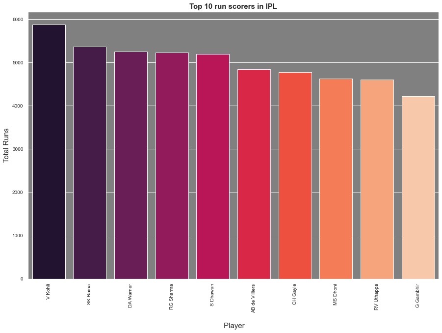
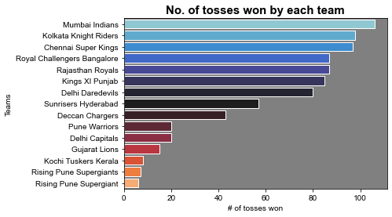
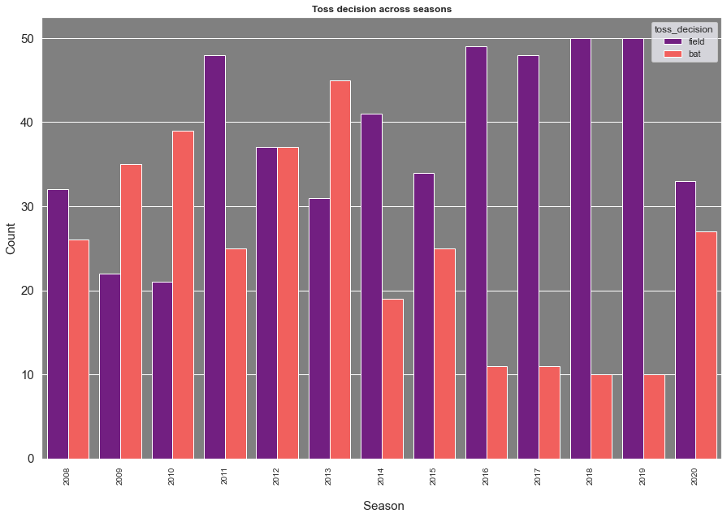
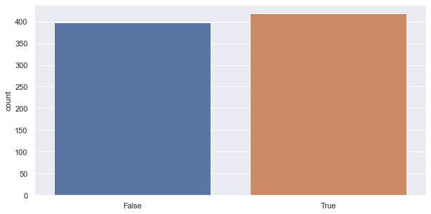
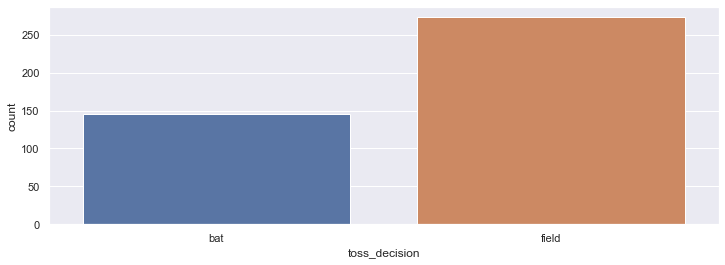
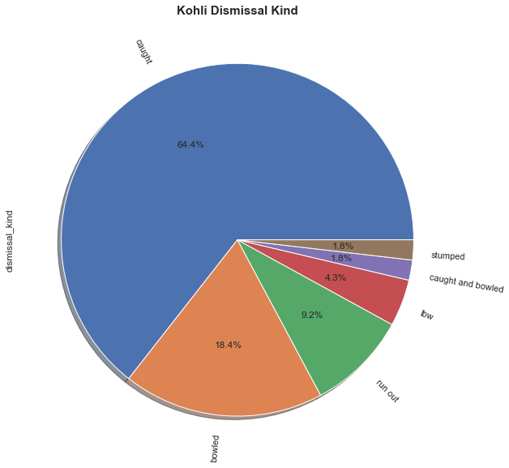
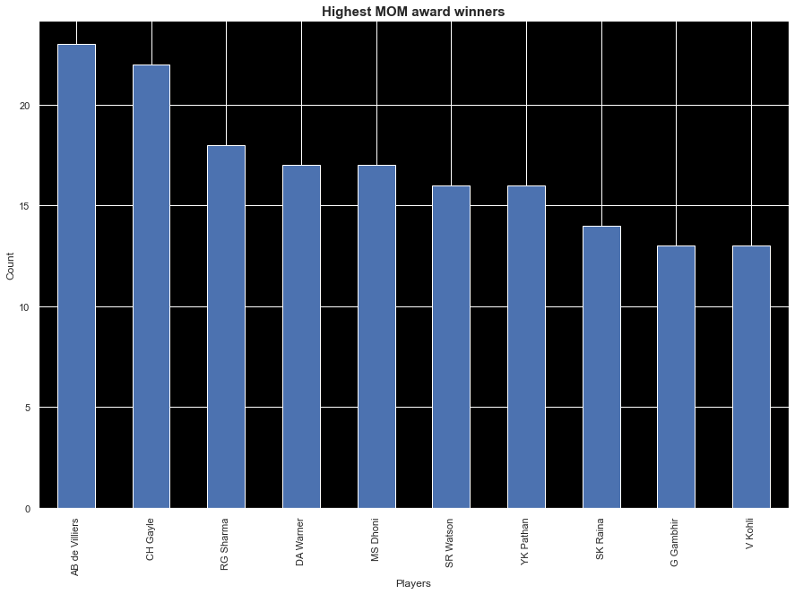

# IPL-EDA-Project
An exploratory data analysis project for the Indian Premier League cricket tournament with Python.

# Indian Premier League
 

The Indian Premier League (IPL) is a very popular professional men's Twenty20 cricket league, during the time of this tournament millions of Indians are glued to their tv screens watching and supporting their favourite teams which represent different cities in India. This is a small explarotary data analysis project which focuses on match data and ball by ball data of matches between the year 2008 and 2020.

Technologies used: Python, Pandas, Numpy, Matplotlib, Seaborn, Github.

## Key Findings:

### 1. Total Matches Played Each Season:

### 2. Total Runs Scored Each Season:

### 3. Highest Run Scorers Across All Seasons:

It can be seen from this chart that Virat Kohli is the highest run scorer across all seasons.

### 4. Number of Tosses Won by each team.

### 5. Decision of Toss across seasons.

From this chart we can determine the decision of tosses across season whether the team chose to bat/field.

### 6. Toss decision = Match Winner

From this chart it can be determined whether toss winner also won the match.

### 7. Toss decision = Match Winner

From this chart it can be determined the number matches won by a team by choosing batting/fielding.

### 8. Virat Kohli dismissal kinds.

This pie chart showcases the dismissal kinds of Virat Kohli the highest run getter and the percentage of his dismissal kinds.

### 9. Highest number of man of the match trophies.

