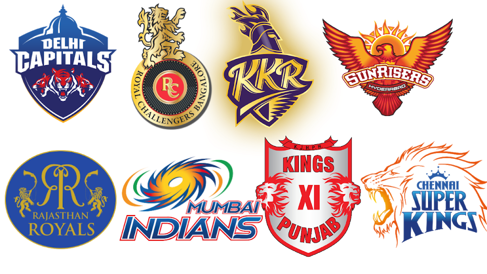

# IPL-EDA-Project
An exploratory data analysis project for the Indian Premier League cricket tournament with Python.

# Indian Premier League
 

The Indian Premier League (IPL) is a very popular professional men's Twenty20 cricket league, during the time of this tournament millions of Indians are glued to their tv screens watching and supporting their favourite teams which represent different cities in India. This is a small explarotary data analysis project which focuses on match data and ball by ball data of matches between the year 2008 and 2020.

Technologies used: Python, Pandas, Numpy, Matplotlib, Seaborn, Github.

## Key Findings:
